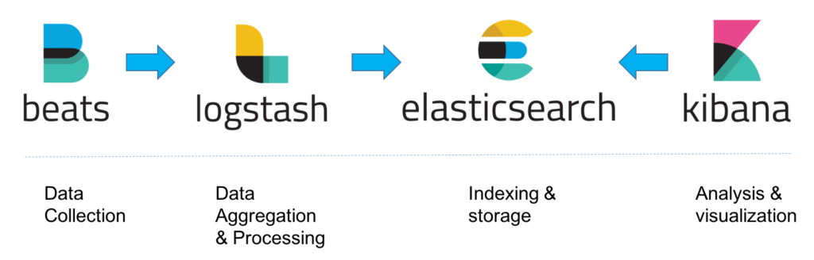

# Centralized Logging
Logs are a critical part of any system, they give you insight into what a system is doing as well what happened. Usually, logs are written to files on local disks. When your system grows to multiple microservices, managing the logs and accessing them can get complicated. With a centralized logging solution, multiple logs can be aggregated/searched/visualized in a central location.

## Notes
To effectively use centralized logging, add correlation Ids to (service) requests.

## Architecture
The ELK Stack, which traditionally consisted of three main components — Elasticsearch, Logstash, and Kibana, is now also used together with what is called “Beats” — Filebeat in this case. 

Filebeat uses a backpressure-sensitive protocol when sending data to Logstash.

